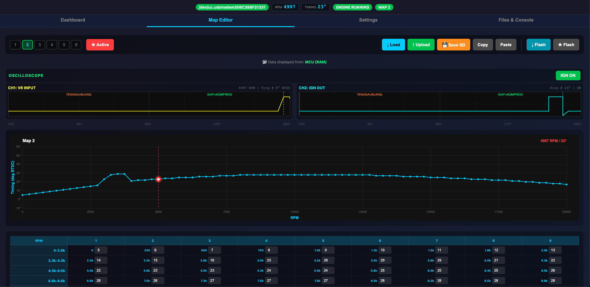
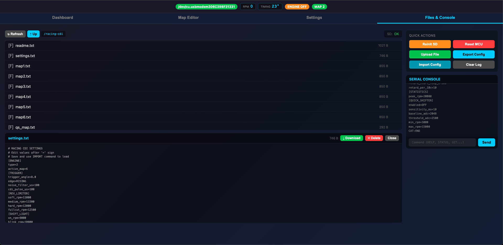

# 🌐 Racing CDI - Web UI Documentation




**Professional web-based control panel for Racing CDI with real-time telemetry, configuration, and tuning.**

---

## 🎯 Features Overview

### 📊 Real-Time Dashboard


- **Live Telemetry** - 20Hz update rate (50ms refresh)
- **RPM Gauge** - Large center display with color-coded bar (0-20,000 RPM)
- **Timing Display** - Current ignition advance in real-time
- **Multi-Gauge Panel** - Temperature, battery, charging, CPU, RAM, peak RPM
- **Rev Limiter Indicator** - 4-stage visual feedback (Soft/Medium/Hard/Full)
- **Engine Status** - Running, Kill switch, Limiter active, warnings
- **Configuration Source** - SD Card, Flash, or Hardcoded indicator

### ⚙️ Configuration Panel


- **Map Selection** - Switch between 6 ignition maps
- **Engine Type** - 2-stroke / 4-stroke mode
- **Quick Shifter** - Enable/disable and calibrate
- **Rev Limiter** - Adjust 4 threshold levels
- **Shift Light** - Configure RPM thresholds
- **Cranking Mode** - Set timing and RPM limits
- **Safety Settings** - Overheat, low battery, over-rev warnings

### 🔧 Tuning Tools


- **Ignition Map Editor** - Visual 81-point curve editor
- **Quick Shifter Map** - 21-point cut time adjustment
- **Live Preview** - See changes before applying
- **Import/Export** - Load and save map files
- **Copy Between Maps** - Duplicate configurations quickly
- **Undo/Redo** - Safe editing with rollback

### 📈 Oscilloscope View

- **Waveform Display** - Trigger and ignition timing visualization
- **Cycle Tracking** - Monitor individual engine cycles
- **Cut Detection** - See when limiter/QS cuts ignition
- **Phase Error** - Visualize timing corrections
- **dRPM Graph** - Acceleration/deceleration tracking
- **Precision Metrics** - Phase correction, timing accuracy

### 📁 File Management



- **SD Card Browser** - View, download, delete files
- **Log Viewer** - Analyze CSV data logs
- **Config Backup** - Save/restore all settings
- **Map Library** - Organize multiple timing maps
- **Firmware Update** - Upload new .bin files (planned)

### 🧪 Calibration Tools

- **ADC Calibration** - Temperature, battery, charging sensors
- **Quick Shifter Calibration** - Baseline and threshold setup
- **Trigger Angle** - Adjust VR sensor position
- **Noise Filter** - Fine-tune signal rejection

### 📡 Diagnostics

- **Serial Monitor** - Direct command interface
- **CPU Usage** - Real-time processor load
- **RAM Usage** - Memory consumption tracking
- **Trigger Count** - Total engine revolutions
- **Cut Count** - Rev limiter activation count
- **Error Messages** - System warnings and alerts

---

## 🚀 Quick Start

### Installation

**1. Install Python Dependencies**

```bash
pip install aiohttp pyserial
```

**2. Download Files**

```bash
# Get the Web UI files
git clone https://github.com/wicaksuu/racing-cdi.git
cd racing-cdi/webui
```

**3. Run Bridge Server**

```bash
python3 bridge.py
```

**4. Open Browser**

```
http://localhost:8080
```

### First Connection

1. **Select Serial Port**

   - Click "Select Port" button in top bar
   - Choose your STM32 device (usually `/dev/ttyACM0` or `COM3`)
   - Click "Connect"

2. **Verify Connection**

   - Status should show "Connected" (green)
   - Live data should start updating
   - RPM gauge should show current engine state

3. **Load Configuration**

   - Click "Config" tab
   - Current settings will load automatically
   - Make changes as needed

4. **Start Tuning!**
   - Go to "Maps" tab to edit ignition curves
   - Use "Scope" tab to monitor timing accuracy
   - Check "Diagnostics" for system health

---

## 📱 User Interface Guide

### Top Status Bar

```
┌──────────────────────────────────────────────────────────┐
│ 🔌 [Connected] 📍COM3  🚦Map 2  ⚡12.6V  🌡️45°C  📊2% CPU│
└──────────────────────────────────────────────────────────┘
```

**Status Indicators:**

- 🔌 **Connection Status** - Green = Connected, Red = Disconnected
- 📍 **Port Name** - Active serial port
- 🚦 **Active Map** - Current map number (1-6)
- ⚡ **Battery** - Real-time voltage (warning if <11V)
- 🌡️ **Temperature** - Cylinder head temp (warning if >100°C)
- 📊 **CPU Usage** - MCU processor load

### Dashboard Tab

**Large RPM Gauge**

```
        ┌─────────────┐
        │     RPM     │
        │   ┌─────┐   │
        │   │ 5420│   │  <- Current RPM (large font)
        │   └─────┘   │
        │ [========>  │  <- RPM bar (color-coded)
        │ [████░░░░]  │  <- Limiter stages
        └─────────────┘
```

**Color Coding:**

- Green: Normal operation (0-8000 RPM)
- Yellow: Approaching limit (8000-9500 RPM)
- Orange: Soft limiter (9500-9750 RPM)
- Red: Hard limiter (9750+ RPM)

**Timing Display**

```
        ┌─────────────┐
        │   TIMING    │
        │   ┌─────┐   │
        │   │ 24.5│   │  <- Current advance (degrees BTDC)
        │   └─────┘   │
        │   degrees   │
        └─────────────┘
```

**6-Gauge Panel**

```
┌─────┬─────┬─────┬─────┬─────┬─────┐
│TEMP │BATT │CHRG │ MAP │PEAK │ CPU │
│ 45° │12.6V│13.8V│  2  │6580 │ 2% │
└─────┴─────┴─────┴─────┴─────┴─────┘
```

### Configuration Tab

**Quick Actions**

```
┌──────────────────────────────────┐
│ Engine Type:  [2-Stroke ▼]       │
│ Active Map:   [Map 2     ▼]       │
│ Quick Shifter: [✓ Enabled]       │
│                                   │
│ [Reload Config]  [Save to SD]    │
└──────────────────────────────────┘
```

**Rev Limiter Settings**

```
┌──────────────────────────────────┐
│ Soft:     [9500  ] RPM           │
│ Medium:   [9750  ] RPM           │
│ Hard:     [10000 ] RPM           │
│ Full Cut: [10250 ] RPM           │
│                                   │
│ [Apply Changes]                   │
└──────────────────────────────────┘
```

**Shift Light**

```
┌──────────────────────────────────┐
│ Solid:     [8000 ] RPM           │
│ Blink:     [8500 ] RPM           │
│ Fast Blink:[9000 ] RPM           │
└──────────────────────────────────┘
```

**Safety Settings**

```
┌──────────────────────────────────┐
│ Over-Rev Warning:  [10500] RPM   │
│ Overheat Temp:     [120  ] °C    │
│ Low Battery:       [11.0 ] V     │
│ Overheat Retard:   [✓] Enabled   │
└──────────────────────────────────┘
```

### Maps Tab

**Curve Editor**

```
  60° ┤                    ╭───────
      │                 ╭──╯
  40° ┤              ╭──╯
      │           ╭──╯
  20° ┤        ╭──╯
      │     ╭──╯
   0° ┤─────╯
      └─────┬─────┬─────┬─────┬─────
         0     5k    10k   15k   20k
              RPM (x1000)
```

**Features:**

- **81 Edit Points** - Click and drag to modify
- **Zoom Controls** - Focus on specific RPM ranges
- **Grid Overlay** - Precise value alignment
- **Value Display** - Shows exact timing at cursor
- **Quick Fill** - Linear, exponential, or custom curves
- **Copy/Paste** - Between maps or RPM ranges

**Map Management**

```
┌──────────────────────────────────┐
│ Source: [Map 1 ▼]  Target: [Map 3 ▼]│
│                                   │
│ [Copy Map]  [Reset to Default]   │
│ [Import File]  [Export File]     │
└──────────────────────────────────┘
```

### Quick Shifter Tab

**Calibration Panel**

```
┌──────────────────────────────────┐
│ Current ADC: [2048] (live)       │
│                                   │
│ [Set Baseline]  [Set Threshold]  │
│                                   │
│ Baseline:   [1024]               │
│ Threshold:  [3072]               │
│ Sensitivity:[10  ] ms            │
│                                   │
│ RPM Range:  [3000] - [10000] RPM │
└──────────────────────────────────┘
```

**Cut Time Map (21 points)**

```
250ms┤
     │ ╲
150ms┤  ╲____
     │       ╲___
 50ms┤           ╲________
     └─────┬─────┬─────┬─────
         0     5k    10k   20k
           RPM (x1000)
```

**Features:**

- **Live ADC Reading** - See sensor value in real-time
- **One-Click Calibration** - Set baseline and threshold
- **RPM-Based Curve** - Shorter cut at high RPM
- **Test Function** - Verify cut without engine running

### Scope Tab

**Waveform Display**

```
     ┌─────────────────────────────┐
  5V │   ┌┐    ┌┐    ┌┐    ┌┐      │ <- Trigger pulses
     │   ││    ││    ││    ││      │
     │   ││    ││    ││    ││      │
  0V │───┘└────┘└────┘└────┘└──────│
     │     ▲     ▲     ▲     ▲     │ <- Ignition fires
     └─────────────────────────────┘
          Time (engine cycles) →
```

**Metrics Panel**

```
┌──────────────────────────────────┐
│ Period:       [12000] ticks      │
│ Delay:        [3500 ] ticks      │
│ Phase Error:  [+2   ] ticks      │
│ dRPM:         [+150 ] RPM/cycle  │
│ Correction:   [-1   ] ticks      │
└──────────────────────────────────┘
```

**Features:**

- **Real-Time Waveforms** - See actual trigger and fire events
- **Cycle-by-Cycle** - Monitor each engine revolution
- **Cut Visualization** - Red X when ignition cut
- **Timing Accuracy** - Shows phase correction working
- **Export Data** - Save waveform for analysis

### Files Tab

**File Browser**

```
┌──────────────────────────────────┐
│ 📁 /racing-cdi/                  │
│   📄 settings.txt      [Download]│
│   📄 map1.txt          [Download]│
│   📄 map2.txt          [Download]│
│   📁 logs/                       │
│     📄 2026-01-20.csv  [View]    │
│     📄 2026-01-19.csv  [View]    │
└──────────────────────────────────┘
```

**Log Viewer**

```
Time,RPM,Timing,Temp,Battery,Limiter,Cut
12:30:01,5420,24.5,45,12.6,0,0
12:30:02,5680,25.0,46,12.6,0,0
12:30:03,8200,28.5,52,12.5,0,0
12:30:04,9600,26.0,58,12.4,1,0 <- Soft limiter
12:30:05,9800,21.0,62,12.3,2,1 <- Medium cut
```

**Features:**

- **File Management** - View, download, delete
- **CSV Preview** - Quick data inspection
- **Download** - Save logs to PC
- **Upload** - Send config files to MCU
- **Directory Navigation** - Browse all SD card contents

### Diagnostics Tab

**System Status**

```
┌──────────────────────────────────┐
│ Firmware:     v1.0.0             │
│ Config Source: SD Card           │
│ Uptime:       2h 34m 18s         │
│ Engine Hours: 127.5h             │
│                                   │
│ CPU Usage:    2%   [==        ]  │
│ RAM Free:     245KB / 256KB      │
│                                   │
│ Triggers:     1,245,680          │
│ Ignitions:    1,245,680          │
│ Cuts:         2,341 (0.19%)      │
└──────────────────────────────────┘
```

**Serial Console**

```
┌──────────────────────────────────┐
│ > STATUS                         │
│ RPM: 5420                        │
│ Timing: 24.5°                    │
│ Temp: 45°C                       │
│                                   │
│ > GET MAP                        │
│ Active: Map 2                    │
│                                   │
│ > _                              │
└──────────────────────────────────┘
```

**Features:**

- **Command Input** - Send any USB command
- **Auto-Scroll** - Latest messages visible
- **History** - Previous commands saved
- **Copy Output** - Select and copy responses
- **Clear Console** - Reset display

---

## 🔧 Technical Details

### WebSocket Protocol

**Data Format:**

```json
{
  "rpm": 5420,
  "timing": 2450, // x100 (24.50°)
  "temp": 45,
  "battery": 126, // x10 (12.6V)
  "charging": 138, // x10 (13.8V)
  "map": 2,
  "limiter": 1, // 0=none, 1=soft, 2=med, 3=hard, 4=full
  "flags": 97, // Bit flags
  "engineRunning": true,
  "overheating": false,
  "lowBattery": false,
  "killActive": false,
  "usingDefaultMap": false,
  "ignitionEnabled": true,
  "sdCardOk": true,
  "peak": 6580,
  "cpu": 2,
  "ram": 96, // Usage percentage
  "trigAngle": 6000, // x100 (60.00°)
  "cut": 0, // Last cycle cut (0/1)
  "engType": 2, // 2 or 4
  "configSource": 0, // 0=SD, 1=Flash, 2=Hardcoded
  "qsAdc": 2048, // Quick shifter ADC (0-4095)
  "tempRaw": 1856, // Temperature ADC raw
  "battRaw": 2560, // Battery ADC raw
  "chrgRaw": 2815, // Charging ADC raw
  "dRpm": 150, // RPM change per cycle
  "phaseCorr": -2 // Phase correction ticks
}
```

**Update Rate:**

- Dashboard: 20 Hz (50ms)
- Scope view: 100 Hz (10ms)
- File operations: On-demand

### Bridge Server Architecture

```
┌──────────┐         ┌──────────┐         ┌──────────┐
│ Browser  │◄───WS──►│  Bridge  │◄──USB──►│  STM32   │
│  (HTML)  │         │ (Python) │         │   CDI    │
└──────────┘         └──────────┘         └──────────┘
     │                     │                     │
     │ HTTP/WebSocket      │ Serial (115200)     │
     │ Port 8080           │ /dev/ttyACM0        │
     └─────────────────────┴─────────────────────┘
```

**Components:**

1. **index.html** - Frontend UI (6000+ lines)
2. **bridge.py** - WebSocket/Serial bridge (300 lines)
3. **STM32 Firmware** - USB CDC device

**Data Flow:**

```
User Action (Browser)
  ↓
WebSocket Message
  ↓
bridge.py Parser
  ↓
Serial Command
  ↓
STM32 Processes
  ↓
Serial Response
  ↓
bridge.py Broadcast
  ↓
WebSocket Update
  ↓
UI Refresh
```

### Browser Compatibility

**Supported Browsers:**

- ✅ Chrome/Chromium 90+ (recommended)
- ✅ Edge 90+
- ✅ Firefox 88+
- ✅ Safari 14+
- ✅ Opera 76+

**Required Features:**

- WebSocket support
- ES6 JavaScript
- Canvas API (for scope view)
- CSS Grid
- Flexbox

**Not Supported:**

- ❌ Internet Explorer (any version)
- ❌ Legacy Edge (pre-Chromium)

---

## 🎨 Customization

### Theme Colors

Edit CSS variables in `index.html`:

```css
:root {
  --primary-color: #00d4ff; /* Cyan accent */
  --danger-color: #ff4444; /* Red warnings */
  --success-color: #00c853; /* Green status */
  --warning-color: #ff9100; /* Orange alerts */
  --background: #1a1a2e; /* Dark background */
  --card-bg: rgba(255, 255, 255, 0.05); /* Semi-transparent */
}
```

### Update Rate

Adjust refresh frequency in JavaScript:

```javascript
// Dashboard update (default: 50ms = 20Hz)
setInterval(updateDashboard, 50);

// Scope update (default: 10ms = 100Hz)
setInterval(updateScope, 10);
```

### Gauge Ranges

Modify gauge maximums:

```javascript
const GAUGE_MAX = {
  rpm: 20000, // Max RPM
  temp: 150, // Max temp (°C)
  battery: 16, // Max voltage
  timing: 60, // Max advance (°)
};
```

---

## 🐛 Troubleshooting

### Cannot Connect to Serial Port

**Symptoms:** Port list shows "No ports found"

**Solutions:**

1. Check USB cable (must support data, not just power)
2. Verify STM32 enumerated: `ls /dev/tty*` or Device Manager
3. Check permissions (Linux): `sudo usermod -a -G dialout $USER`
4. Try different USB port
5. Restart bridge server

### WebSocket Disconnects

**Symptoms:** "Disconnected" in status bar, auto-reconnect fails

**Solutions:**

1. Check bridge.py is running: `python3 bridge.py`
2. Verify port 8080 not in use: `netstat -an | grep 8080`
3. Check firewall settings
4. Restart browser (clear WebSocket connections)
5. Check console for errors (F12 developer tools)

### Data Not Updating

**Symptoms:** Dashboard frozen, old values displayed

**Solutions:**

1. Verify MCU connected (check status LED)
2. Send `STATUS` command via serial console
3. Check MCU is sending RT: messages (should be 20Hz)
4. Restart bridge server
5. Hard refresh browser (Ctrl+Shift+R)

### Map Editor Not Responding

**Symptoms:** Cannot click points, drag doesn't work

**Solutions:**

1. Ensure map loaded: Check "Source Map" dropdown
2. Click "Load Map" button if needed
3. Check if edit mode enabled (should say "Editing: Map X")
4. Disable browser extensions (they may block events)
5. Try different browser

### File Operations Fail

**Symptoms:** "SD card error", cannot download/upload files

**Solutions:**

1. Check SD card inserted in MCU
2. Verify SD initialized: Send `STATUS` via console
3. Check file permissions on bridge.py
4. Ensure SD not write-protected
5. Format card as FAT32 if corrupt

---

## 📊 Performance Tips

### Optimize Update Rate

**For smooth UI on low-end PCs:**

```javascript
// Reduce update rate
setInterval(updateDashboard, 100); // 10Hz instead of 20Hz
setInterval(updateScope, 50); // 20Hz instead of 100Hz
```

### Reduce CPU Usage

**Disable features not needed:**

```javascript
// Disable scope if not using
const ENABLE_SCOPE = false;

// Disable animations
const ENABLE_ANIMATIONS = false;
```

### Memory Management

**Clear old logs periodically:**

```bash
# In Files tab, delete old CSV files
# Keep only recent data to reduce browser memory
```

---

## 🔐 Security Notes

**WARNING:** This UI has no authentication!

**Recommendations:**

1. **Run only on localhost** - Don't expose to internet
2. **Firewall port 8080** - Block external access
3. **Use VPN** for remote access if needed
4. **No sensitive data** - UI doesn't store passwords

**For production use, add:**

- [ ] HTTPS/TLS encryption
- [ ] Password authentication
- [ ] Session management
- [ ] Input validation
- [ ] CSRF protection

---

## 🚀 Advanced Usage

### Multiple Connections

Run multiple browser tabs to monitor different views:

```
Tab 1: Dashboard (live telemetry)
Tab 2: Maps (editing curves)
Tab 3: Scope (timing analysis)
Tab 4: Files (log review)
```

All tabs sync in real-time!

### Remote Access

Access UI from another device on network:

```bash
# Find server IP
ip addr show  # Linux
ipconfig      # Windows

# Connect from phone/tablet
http://192.168.1.100:8080
```

### Data Export

**Export telemetry for external analysis:**

1. Open browser console (F12)
2. Run: `localStorage.getItem('telemetry_log')`
3. Copy JSON data
4. Import to Excel, MATLAB, Python, etc.

### API Integration

**Control MCU from scripts:**

```python
import websocket
import json

ws = websocket.create_connection("ws://localhost:8080/ws")

# Send command
ws.send(json.dumps({"command": "GET RPM"}))

# Receive response
result = ws.recv()
print(json.loads(result))
```

---

## 📝 Changelog

### v1.0 (Current)

- ✅ Real-time dashboard with 20Hz updates
- ✅ 6-map management with visual editor
- ✅ Quick shifter calibration
- ✅ Oscilloscope view with waveforms
- ✅ File browser and log viewer
- ✅ Serial console
- ✅ Diagnostics panel

### v1.1 (Planned)

- [ ] Dark/light theme toggle
- [ ] Mobile-responsive design
- [ ] Touch gesture support
- [ ] Multi-language support
- [ ] Offline mode (PWA)

### v2.0 (Future)

- [ ] 3D timing surface visualization
- [ ] Auto-tune algorithm
- [ ] Comparison mode (before/after)
- [ ] Video recording of sessions
- [ ] Cloud sync (optional)

---

## 🙏 Credits

**UI Framework:** Vanilla JavaScript (no dependencies!)  
**Charts:** Custom Canvas rendering  
**Icons:** Unicode symbols  
**Bridge:** Python aiohttp + pyserial

**Inspired by:**

- TunerStudio (MegaSquirt)
- RomRaider (Subaru ECU)
- Chrome DevTools

---

## 📞 Support

**Issues:** [GitHub Issues](https://github.com/wicaksuu/racing-cdi/issues)  
**Discussions:** [GitHub Discussions](https://github.com/wicaksuu/racing-cdi/discussions)  
**Email:** ig@wicak.id

---

## 📄 License

MIT License - See [LICENSE](../LICENSE) file

---

**🌐 Enjoy the Web UI! 🏁**
